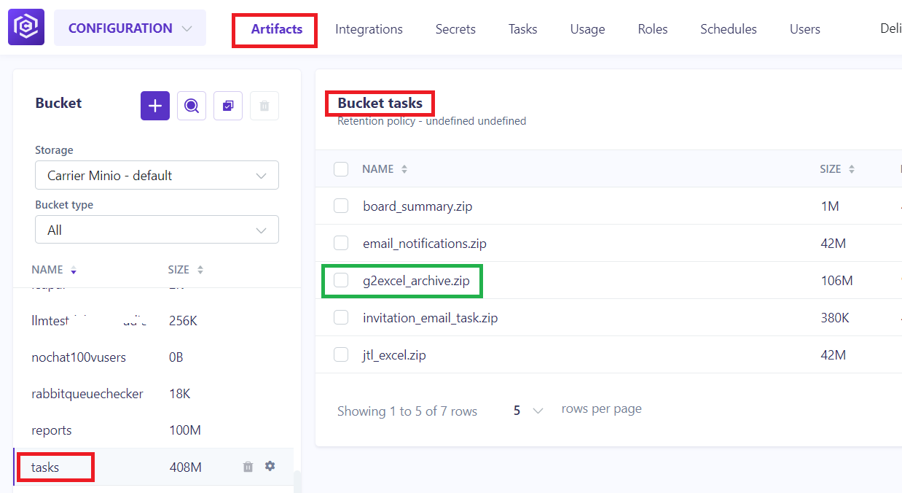
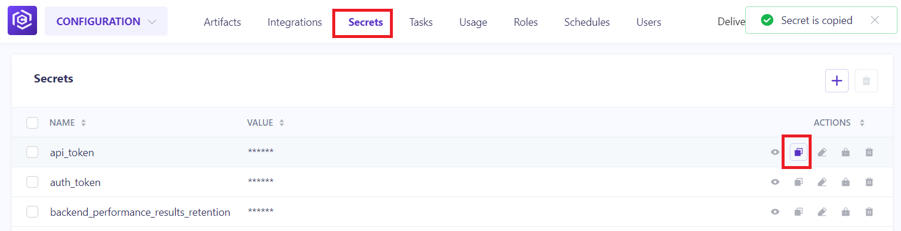
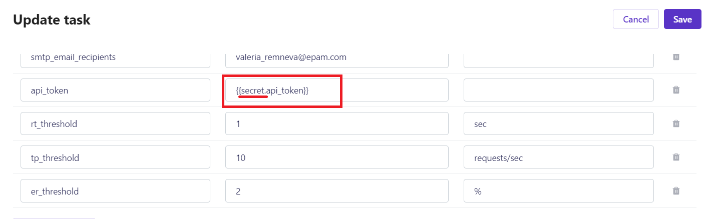

## Overview

This guide provides step-by-step instructions on how to create custom tasks (AWS lambdas) and execute using Carrier Platform. Using custom tasks you can add additional functionality for processing and reporting test results. Additional info about lambdas you can find [here](https://github.com/carrier-io/docker-lambda)

### Entrypoint and parameters for task

The Lambda function handler is the method in your function code that processes events. When your function is invoked, Lambda runs the handler method. Your function runs until the handler returns a response, exits, or times out. You can use the following general syntax when creating a function handler in Python:

```bash
def handler_name(event, context):
    ...
    return some_value
```

The Lambda function handler name specified at the time that you create a Task in Carrier is derived from:

   - The name of the file in which the Lambda handler function is located.

   - The name of the Python handler function.

A function handler can be any name; however, the default name in the Lambda console is lambda_function.lambda_handler. This function handler name reflects the function name (lambda_handler) and the file where the handler code is stored (lambda_function.py).

The first argument for lambda handler is the event object. It contains all the parameters that you have specified for the task during task creation. An event is a JSON-formatted document that contains data for a Lambda function to process. The Lambda runtime converts the event to an object and passes it to your function code. It is usually of the Python dict type. It can also be list, str, int, float, or the NoneType type.

In your function code you can read parameters from event object like this:

```bash
report_id = event.get("report_id")
project_id = event.get("project_id")
token = event.get("token")
some_parameter = event.get("some_parameter")
```

### Additional requirements and packaging

The official documentation from AWS you can find [here](https://docs.aws.amazon.com/lambda/latest/dg/python-package.html#python-package-create-dependencies)

If your function requires some not standard python libraries you need to specify them in requirements.txt file. Example you can find [here](https://github.com/carrier-io/control_tower/blob/master/package/requirements.txt). After that you can build your lambda function as zip archive using instruction from official documentation. Also, you can create a bash script to build lambda function using docker container + zip utility. An example below:

```bash
#!/bin/bash

mkdir lambda
# build all dependencies from requirements.txt
docker run --rm -v "$PWD":/var/task lambci/lambda:build-python3.7 pip install -r requirements.txt -t /var/task/lambda
# copy some additional code required by lambda function
cp -r perfreporter lambda/perfreporter
# copy template for email notification
cp -r templates lambda/templates
# copy lambda handler
cp post_processing.py lambda/post_processing.py
cd lambda
# create zip archive
zip jtl_to_excel.zip -r .
cp jtl_to_excel.zip ../
cd ..
rm -rf lambda
```

### Create task in Carrier

To create a lambda task in Carrier Platform you should follow next steps:

1. Go to Configuration section and then select Tasks subsection

2. Click "+" button to start creation of new task

3. Set task name and select Runtime for your function

4. Upload your zip file with lambda function and specify lambda handler


In case if you already created your task and need to upload new/updated zip file, you can:

4.1. Open 'Artifacts' tab, scroll down and find 'Bucket tasks'.

4.2. Drag and drop updated zip archive with the same name and wait when the file be updated ('Last update' date will be changed)


5. Add parameters for your task


In case if parameters are going to be used from 'Secrets' please:

5.1. Go to the 'Secrets' tab (on this step, you can already save your Task so as not to lose the data you have entered before)

5.2. Click 'Copy' opposite the parameter's name which you want to copy


5.3. Insert copied value in the 'DEFAULT VALUE' column for your parameter and add '*secret.*' before it (as it showed on the picture below):


5.4. Fill in other necessary fields and check the parameters values don't contain unnecessary spaces.

6. Click Save button to create the task


### Execute task

To execute the task you need to select it from tasks list and click Play button


After that you can check tasks logs in runtime below

